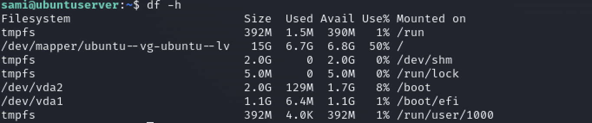

## 1. CPU Load and Usage
Monitoring CPU load is crucial as it affects the system's performance and responsiveness.

Commands:
- `top` and `htop` provide a dynamic real-time view of running processes, including CPU usage.
uptime shows the system load averages for the past 1, 5, and 15 minutes.
- `vmstat` reports information about processes, memory, paging, block IO, traps, and CPU activity.
- `mpstat` -P ALL shows the CPU usage of all CPUs.

_(Useful) Tools_ : 

- `Sentry` : Error monitoring | Session replay | Performances | Code Coverage
- `Datadog` : Log Management | Security Monitoring | Network Monitoring | User Monitoring | Serviceless

## 2. Memory Usage
Memory usage monitoring helps in identifying memory leaks or processes that are using excessive memory.

Commands:
- `free -m` displays the total amount of free and used physical and swap memory in the system.
- `vmstat` also provides information about memory usage.
- `top` and `htop` can be used to identify memory-intensive processes.

## 3. Disk Usage and I/O
Monitoring disk usage is essential to prevent the system from running out of space, which can lead to service interruptions.

Commands:
- `df -h` shows disk space usage of all mounted filesystems.
- `du -sh` displays the size of directory trees along with their contained files.
- `iotop` monitors disk I/O by processes.
- `lsblk` lists information about all available or the specified block devices.

## 4. Network Traffic
Understanding network traffic and throughput is vital for maintaining network performance and security.

Commands:
- `netstat` provides various network-related information including open connections and routing tables.
- `ss` is a utility to investigate sockets.
- `iftop` and `nload` display bandwidth usage on an interface.
- `tcpdump` for capturing and analyzing network packets.

## 5. Log Files
Logs are crucial for understanding what's happening on a system, including system errors, security alerts, and operational information.

Important Log Files:
- `/var/log/syslog` or `/var/log/messages` for general system activity logs.
- `/var/log/auth.log` for system authorization information.
- `/var/log/kern.log` for kernel logs.
- `/var/log/dmesg` for system boot messages.
- `journalctl` for querying and displaying messages from the systemd journal.

## 6. System Uptime and Load
System uptime indicates how long the system has been running, which can be useful for tracking the stability and reliability of the system.

Commands:
- `uptime` shows how long the system has been running along with load averages.
- `w` displays who is logged on and their activity, along with load averages.

## 7. User Activity
Monitoring user activity is important for security and auditing purposes.

Commands:
- `last` shows a listing of last logged in users.
- `who` shows who is logged into the system.
- `auditd` and related tools (`ausearch`, `auditctl`) for advanced auditing of user actions.

## 8. Process Monitoring
Keeping an eye on running processes is essential for ensuring that services are running as expected.

Commands:
- `ps` aux or `ps -ef` for a snapshot of currently running processes.
- `pstree` displays a tree of processes.
- `top`, `htop` for dynamic real-time process monitoring.

## 9. Swap Usage
Monitoring swap usage is essential, especially on systems with limited RAM. Excessive swap usage can significantly degrade performance.

Commands:
- `swapon -s` provides swap usage summary.
- `free -m` shows both RAM and swap usage.

## 10. Hardware Health
Monitoring the health of physical hardware can prevent failures. Tools like smartctl for hard drives and lm_sensors for temperature sensors are invaluable.

__Tools__ :
- `smartctl -a /dev/sda` checks the health of a hard disk.
- `sensors` displays temperatures, voltages, and fan speeds.

## 11. System Security
Ensuring the system is secure involves monitoring for unauthorized access attempts, checking for rootkits, and ensuring patches are applied.

__Tools and Commands__:
- `fail2ban` monitors log files for too many failed login attempts and bans offending IPs.
- `rkhunter` and `chkrootkit` scan for rootkits.
- `unattended-upgrades` or yum-cron for automatic security updates.

## 12. File System Integrity
Monitoring file system integrity ensures critical files have not been altered, an important part of maintaining system security.

__Tools__:
- `AIDE` (Advanced Intrusion Detection Environment) or `Tripwire` for file integrity checks.

## 13. Backup Systems
Regularly monitoring backup systems ensures that data can be recovered in case of corruption or loss.

__Considerations__:
Verify backup completion.
Test data restoration regularly.

## 14. Service Availability
Monitoring the availability and responsiveness of services is crucial for maintaining application performance and uptime.

__Tools__:
- `ping` for basic network availability.
- `nagios` or `Zabbix` for comprehensive service monitoring.

## 15. SSL Certificate Expiry
Monitoring SSL certificate expiry dates is crucial to prevent service interruptions.

__Tools__:
- `openssl` command-line tool to check the expiry date of SSL certificates.
- Automated monitoring scripts that alert before certificates expire.

## 16. Load Balancer Performance
In environments using load balancers, monitoring their performance ensures traffic is efficiently distributed without bottlenecks.

__Considerations__:
Monitor connection counts and throughput.
Check for errors or dropped connections.

## 17. Database Performance
Databases are often the backbone of applications, making their performance monitoring critical.

__Tools and Metrics__:
- Query execution times.
- Connection counts.
- `mysqltuner` for MySQL performance tuning.

## 18. Application Performance Monitoring (APM)
APM tools provide insights into how applications perform and how transactions flow through the infrastructure.

__Tools__:
- `New Relic`, `Datadog`, and `Dynatrace` offer deep application performance insights.

## 19. Performance Metrics
Collecting and analyzing performance metrics helps in identifying bottlenecks and areas for improvement.

Tools:
- `sar` collects, reports, or saves system activity information.
- `perf` is a powerful tool for performance analysis.
- `nmon` provides performance information in a compact view.

## 20.Cloud Services and Infrastructure Monitoring
For systems hosted in the cloud, monitoring provided by the cloud provider, as well as third-party tools, can offer insights into usage, performance, and cost.

__Tools and Services__:
- AWS CloudWatch, Azure Monitor, and Google Cloud Operations suite for native cloud monitoring.
- `Terraform` for infrastructure as code (IaC) to manage and monitor infrastructure changes.