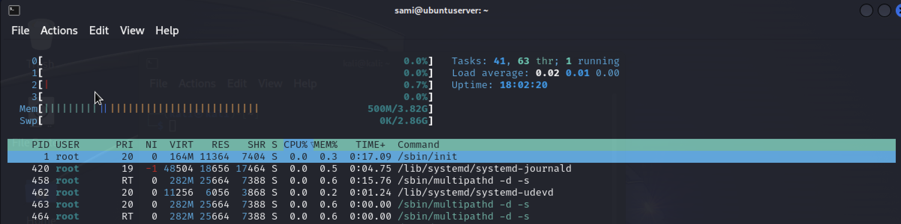

### Linux - Monitoring_101

- __Module__: Linux Administration
- __Competence__: is able to gather information about the state of a linux machine
- __Type of Challenge__: Consolidation
- __Duration__: 3 days
- __Deadline__: 09/04/2024
- __Participants__: : solo

### Introduction

This report offers a succinct overview of the monitoring strategies deployed on our Linux server, situated within a virtual machine environment. 

It emphasizes critical performance indicators such as CPU load, memory utilization, disk I/O operations, and network traffic. 
Leveraging a comprehensive suite of monitoring tools, our objective is to ensure the server operates at peak performance and security levels. 

Through diligent analysis of these essential metrics, we proactively identify and address potential issues, reinforcing the server's efficiency and reliability as integral to our IT infrastructure.

### Key Performance Indicators (KPIs) for Linux Servers

- CPU Load and Usage

CPU usage is the percentage of the CPU's capacity that is currently being used by processes, while CPU load is a measure of the amount of computational work that a computer system performs.
 
CPU load and usage is critical for maintaining system health and performance.

 

 

The __CPU__ usage percentages show that 100% of the __CPU__ time is idle (100.0 id).

With no time spent on user processes (0.0 us), system processes (0.0 sy), nice processes (0.0 ni), I/O wait (0.0 wa), hardware interrupts (0.0 hi), software interrupts (0.0 si), or steal time (0.0 st). 

This reinforces the system's current state of very low activity, with the CPU essentially waiting for work.

- Memory Utilization

Memory utilization refers to how a computer's memory resources, primarily physical RAM (Random Access Memory), are being used at any given time.

Monitoring memory utilization is vital for several reasons such as : Performance Optimization, System Stability, Capacity Planning

 

The system has 3.82 GiB of RAM, with only about 347 MiB actively used by processes, and 2.96 GiB free.
An additional 534 MiB is allocated for buffers/cache, leaving 3.32 GiB readily available for new processes. 

No swap is in use, indicating the system is operating efficiently with ample memory resources under the current workload.

- Disk I/O Operations

Disk I/O operations refer to the read and write operations performed on a storage device. This includes data being written to the disk (output) and read from the disk (input).

 

The server is showing minimal CPU activity with 99.84% idle time, indicating it's under very light load. Disk I/O on devices dm-0 and vda is modest, with slightly more write operations than reads, but overall low activity. 

Loop devices and sr0 show negligible to no activity. This suggests the server currently has significant spare capacity for additional tasks without performance degradation.

- Network Traffic Analysis

Network traffic analysis involves monitoring and analyzing the flow of data across a network to identify the types, sources, and destinations of traffic.

 

 

The server has an established SSH connection from 192.168.64.2, indicating remote management activity without congestion. 

UNIX domain sockets show standard operation with active logging (systemd, syslog) and a running Postfix mail server, suggesting normal system and email processing activities. 

No immediate issues are evident from these connections and sockets, highlighting a smoothly running system. Continuous monitoring is advised for maintaining security and performance.

### Monitoring Tools and Techniques

Monitoring tools are super important in the world of IT. 
They help make sure everything runs smoothly, safely, and without any hiccups. 

These tools keep an eye on all the tech stuff - like computers, programs, and networks - and let IT folks know how things are doing in real-time. This way, they can spot and fix any problems before they cause trouble for users or the business.

- __System Performance Monitoring__: These tools check on the computer's brain (CPU), memory, and storage to see how hard they're working and if they're getting too crowded or slow.
- __Network Traffic Monitoring__: Imagine these as traffic reporters, watching data move across our internet highways. They spot where the traffic jams are and figure out how everyone's using the roads.
- __Log Analysis Tools__: These are like detectives for computer activities. They gather clues (log files) from different parts of the system to solve mysteries or find out what's normal and what's not.
- __Security Monitoring__: These tools are the guards, always on the lookout for anything fishy that might harm the system, keeping it safe from hackers and viruses."

#### System Performance Monitoring

- Nagios: An open-source tool that offers comprehensive monitoring of servers, network services, applications, and network infrastructure.
- Zabbix: Another open-source solution that monitors numerous system parameters, network devices, servers, and virtual machines.

 

#### Network Traffic Monitoring

- Wireshark: A widely-used network protocol analyzer that lets you capture and interactively browse the traffic running on a computer network.
- ntopng : A network traffic probe that shows network usage in a way similar to what top does for processes.

 

#### Log Analysis Tools

- ELK Stack (Elasticsearch, Logstash, Kibana): A set of powerful open-source tools for searching, analyzing, and visualizing logs.
- Splunk: A commercial tool that captures, indexes, and correlates real-time data in a searchable repository.

 

#### Security Monitoring

- Snort: An open-source network intrusion detection system (NIDS) capable of performing real-time traffic analysis and packet logging.
- OSSEC: An open-source host-based intrusion detection system (HIDS) that performs log analysis, file integrity checking, policy monitoring, and rootkit detection.

 

### Proactive Monitoring Strategies

Proactive monitoring is like having a crystal ball for your IT system. 

It's all about spotting small issues and fixing them before they turn into big headaches. Instead of waiting for something to break and then scrambling to fix it (that's reactive monitoring), proactive monitoring keeps an eye on how everything's running all the time.

By keeping track of how the system's doing, it can give a heads-up if something's about to go wrong, helping avoid downtime, slow performance, or security risks.

#### Essentials of Proactive Monitoring :

- ___Setting Up a Starting Point___

___What It Means___: 

Imagine drawing a line in the sand to show where things stand when they're going smoothly with your computer system. This line, or 'baseline,' helps you understand what's normal for your system. It's like knowing how your car feels when it's running right, so you can tell when something's off.

___How It Works___: 

Let's say you have a website. You'd keep track of how fast it responds to clicks, how much brainpower (CPU) and memory it uses during busy and quiet times, and how many visitors it gets. This info forms your baseline. If your website's brainpower suddenly goes through the roof but you don't have more visitors than usual, something might be up—like a wrong setting or a virus.

- ___Setting Up Automatic Heads-ups___

___What It Means___: 
 
Think of automated alerts and notifications like your phone buzzing when something important happens. They're set up to quickly let the people managing computer systems know when something might be going wrong. These alerts pop up because of certain rules or when something unusual is spotted in how the system is working.

___How It Works___: 
 
Imagine you run an online store. You could have a system in place that sends out an alert whenever too many sales don't go through properly. If the number of failed sales suddenly jumps higher than usual, the system immediately lets your tech team know. This way, they can jump in, figure out what's wrong, and fix it fast, so it doesn't hurt your sales.

- ___Routine Check-ups___

___What It Means___: 

Think of regular system audits like taking your car in for check-ups, even when it seems to be running fine. It's about regularly going through the system's records, safety measures, and how well everything's working to make sure everything's in tip-top shape and follows the rules for keeping data safe.

___How It Works___: 

For instance, imagine you're in charge of keeping a company's computer network safe. You might decide to do a thorough check every month. You'd look over the settings for the firewall (which helps keep hackers out), who has permission to access what, and comb through recent records for any signs of hacking attempts. These routine checks help catch and fix any weak spots before they can be exploited

### Conclusion and Recommendations

##### Wrapping It Up

___Recap of Discoveries___: Let's quickly go over what we've learned from keeping an eye on our system. We've pinpointed some key issues, noticed certain trends, and got a good gauge on how healthy and efficient our system is overall.

___Why Monitoring Matters___: Remember, staying on top of monitoring is like having a health routine for your system. It keeps things running smoothly, beefs up security, and makes sure everything performs at its best.

__Recommendations__:
Fixing What's Wrong: Came across some glitches? Let's talk about how to sort them out. If we're dealing with slowdowns, maybe it's time for an upgrade or tweaking some settings.

___Be Proactive___: It's all about staying one step ahead. Let's double down on monitoring before issues even arise, using the right tools and approaches that we've seen work.

___Keep Evolving___: Systems change, and so do the bad guys' tricks. That's why we should regularly revisit our monitoring game plan, tweaking it to stay current.

___Knowledge is Power___: And finally, let's make sure our IT team is up to speed on the latest in monitoring savvy. The right training can make all the difference in catching and dealing with alerts effectively.

  

