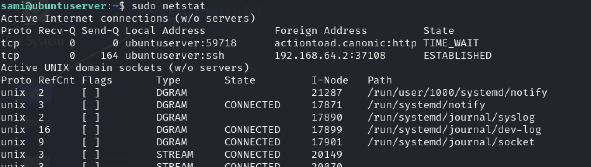

### Linux - Monitoring_101

- __Module__: Linux Administration
- __Competence__: is able to gather information about the state of a linux machine
- __Type of Challenge__: Consolidation
- __Duration__: 3 days
- __Deadline__: 09/04/2024
- __Participants__: : solo

### Introduction

This report offers a succinct overview of the monitoring strategies deployed on our Linux server, situated within a virtual machine environment. 

It emphasizes critical performance indicators such as CPU load, memory utilization, disk I/O operations, and network traffic. 
Leveraging a comprehensive suite of monitoring tools, our objective is to ensure the server operates at peak performance and security levels. 

Through diligent analysis of these essential metrics, we proactively identify and address potential issues, reinforcing the server's efficiency and reliability as integral to our IT infrastructure.

### Key Performance Indicators (KPIs) for Linux Servers

- CPU Load and Usage

CPU usage is the percentage of the CPU's capacity that is currently being used by processes, while CPU load is a measure of the amount of computational work that a computer system performs.
 
CPU load and usage is critical for maintaining system health and performance.

 

 

The __CPU__ usage percentages show that 100% of the __CPU__ time is idle (100.0 id).

With no time spent on user processes (0.0 us), system processes (0.0 sy), nice processes (0.0 ni), I/O wait (0.0 wa), hardware interrupts (0.0 hi), software interrupts (0.0 si), or steal time (0.0 st). 

This reinforces the system's current state of very low activity, with the CPU essentially waiting for work.

- Memory Utilization

Memory utilization refers to how a computer's memory resources, primarily physical RAM (Random Access Memory), are being used at any given time.

Monitoring memory utilization is vital for several reasons such as : Performance Optimization, System Stability, Capacity Planning

 

The system has 3.82 GiB of RAM, with only about 347 MiB actively used by processes, and 2.96 GiB free.
An additional 534 MiB is allocated for buffers/cache, leaving 3.32 GiB readily available for new processes. 

No swap is in use, indicating the system is operating efficiently with ample memory resources under the current workload.

- Disk I/O Operations

Disk I/O operations refer to the read and write operations performed on a storage device. This includes data being written to the disk (output) and read from the disk (input).

 

The server is showing minimal CPU activity with 99.84% idle time, indicating it's under very light load. Disk I/O on devices dm-0 and vda is modest, with slightly more write operations than reads, but overall low activity. 

Loop devices and sr0 show negligible to no activity. This suggests the server currently has significant spare capacity for additional tasks without performance degradation.

- Network Traffic Analysis

Network traffic analysis involves monitoring and analyzing the flow of data across a network to identify the types, sources, and destinations of traffic.

 

 

The server has an established SSH connection from 192.168.64.2, indicating remote management activity without congestion. 

UNIX domain sockets show standard operation with active logging (systemd, syslog) and a running Postfix mail server, suggesting normal system and email processing activities. 

No immediate issues are evident from these connections and sockets, highlighting a smoothly running system. Continuous monitoring is advised for maintaining security and performance.

### Monitoring Tools and Techniques

### Proactive Monitoring Strategies

### Conclusion and Recommendations
